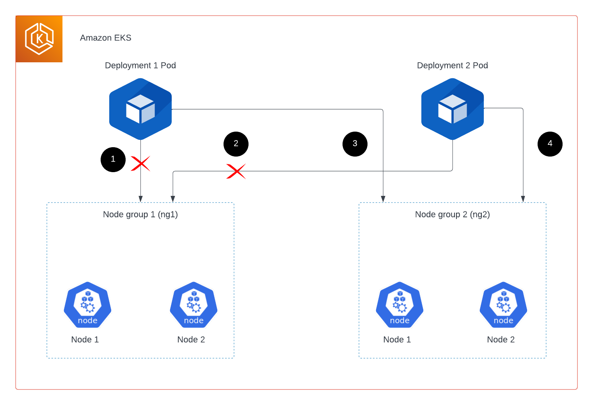

# EKS Nodegroup Rotation

This repo holds the nodegroup rotation workflow which will create one node in new nodegroup and delete one node from older nodegroup in rolling restart fashion. 
And, also transfer the workload from older nodegroups to new nodegroups.

## Description
Node rotation involves replacing existing nodes within a cluster with new nodes without disrupting the overall functionality of the applications running on the cluster. This process ensures that the cluster remains healthy, secure, and up-to-date with the latest software patches and security fixes.

## Pre-requistie
1. awscli 
2. eksctl
3. kubectl 
4. jq
5. aws credential setup

## Architecture

## Usage
These are the steps to be followed to execute the shell script:
1. git clone this repository.
2. Execute the shell script by nodegroup_rotation.sh 
    a. ./nodegroup_rotation.sh <cluster_name> <new_nodegroup_name>
    b. sh nodegroup_rotation.sh <cluster_name> <new_nodegroup_name>

## Security

See [CONTRIBUTING](CONTRIBUTING.md#security-issue-notifications) for more information.

## License

This library is licensed under the MIT-0 License. See the LICENSE file.

